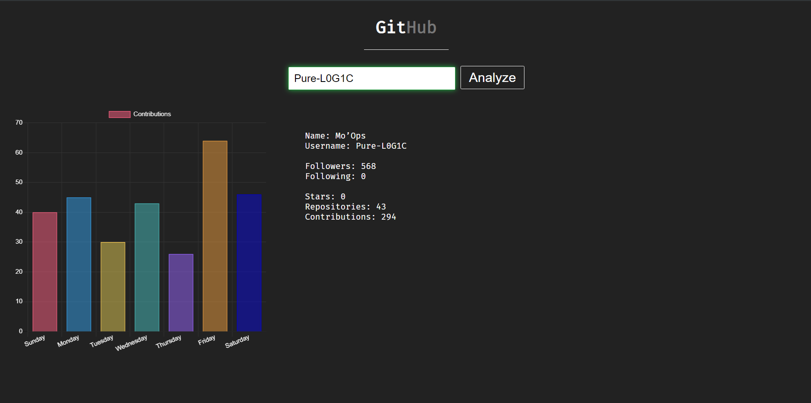

# GitHub-analysis

A simple site for analyzing GitHub accounts



### Reason

You can learn a lot from a developer based on their contributions on GitHub.
The more contributions a developer makes, the more likely you are to predict their personality.

### Install

```
pip install -r requirements.txt
```

### Start

```
python main.py
```
